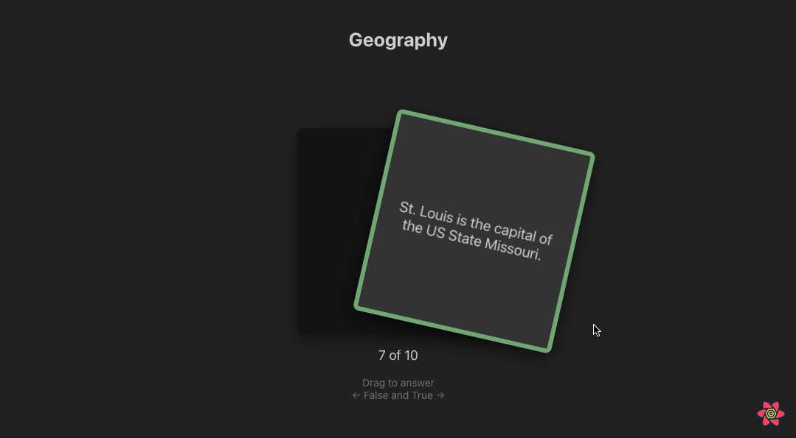
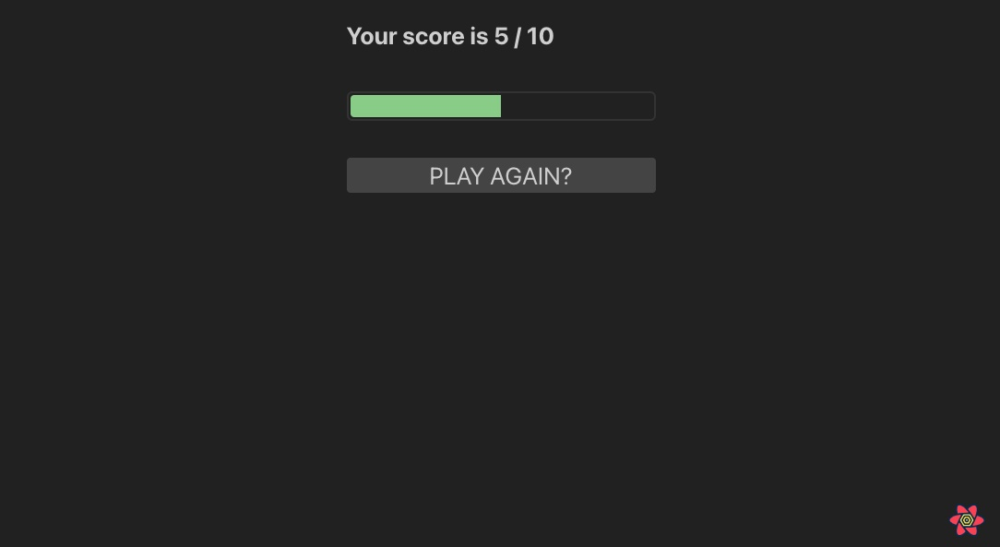

# Quiz Simple React

Project started with [Create React App](https://github.com/facebook/create-react-app).

# What's this

This application is quite simple, it fetches [an api](https://opentdb.com/api.php) to get **10** easy quiz questions. The user is allowed to answer **True** or **False**, by dragging the question card to the left(False) or to the right(True).

The first information at the top is the **Category** of each question provided by the api.

After answering all the questions you will be presented with your result.

# Technologies

### Setup

- `create-react-app`: to create the initial project structure
- `eslint + prettier`: to guarantee code standards
- `editorconfig`: to guarantee code configurations across different editors

### Application

- `axios`: to fetch api
- `humps`: to keep a consistent naming convention for the front end [`camelCase`]
- `react-query`: to fetch api and persist in cache
- `framer-motion`: to animate swipe to answer the quiz
- `CSS Modules`: to style screens and components
- `jest + react-testing-library`: to test the application
  - note: not all the app has tests written yet
- `msw`: to mock information to run tests

# Usage

> Before running any commands below make sure to \
> install all dependencies (`yarn` or `npm install`)

## How to run the application locally

> `yarn start` or `npm run start`

Runs the app in development mode.\
Open [http://localhost:3000](http://localhost:3000) to view it in your browser.

The page will reload when you make changes.

## How to build for production

> `yarn build` or `npm run build`

Builds the app for production to the `build` folder.\
It correctly bundles React in production mode and optimizes the build for the best performance.

The build is minified and the filenames include hashes.

See create-react-app's section about [deployment](https://facebook.github.io/create-react-app/docs/deployment) for more information.

# Thanks 👋🏻
